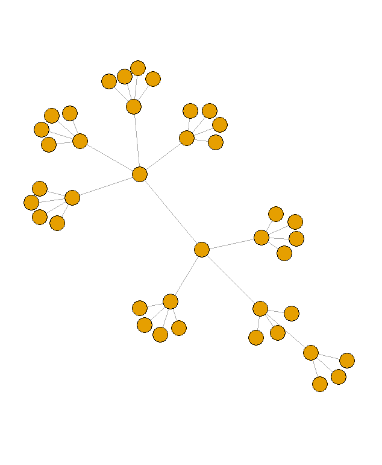
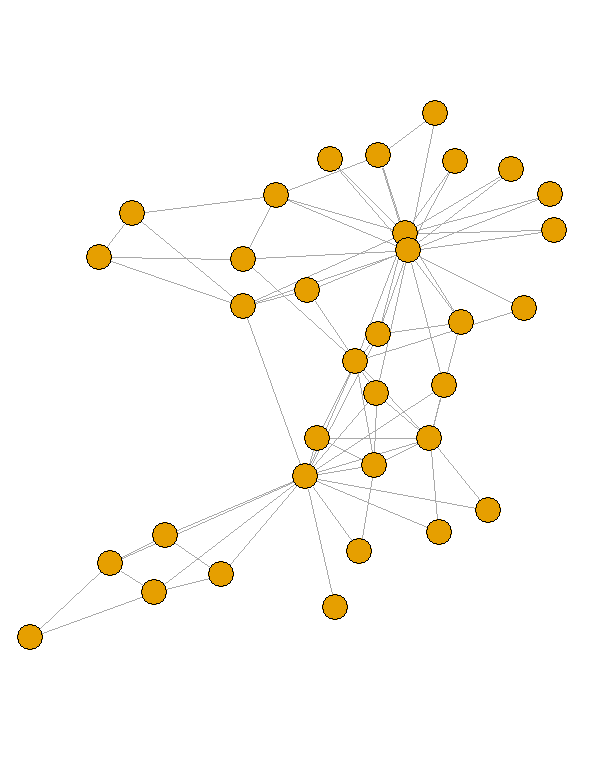

[](http://quantlet.de/)

## [](http://quantlet.de/) **Network_Plots** [](http://quantlet.de/)

```yaml

Name of Quantlet:  Network_Plots
 
Published in:      ""
  
Description:       Networks R Code
 
Keywords:          Networks

See also :         crix, econ_arima, econ_crix, econ_garch, econ_vola

Author:            Raphael Reule
  
Submitted:         Wed, December 23 2017 by Raphael Reule
  
Datafile:          R Script


  

```






### R Code
```r

install.packages("igraph")
library(igraph) 

#centralized
tr = make_tree(40, children = 3, mode = "undirected")
plot(tr, vertex.size=10, vertex.label=NA)

#decentralized
tr = make_tree(40, children = 4, mode = "undirected")
plot(tr, vertex.size=10, vertex.label=NA)

#distributed
zach = graph("Zachary")
plot(zach, vertex.size=10, vertex.label=NA)

```

automatically created on 2018-09-04